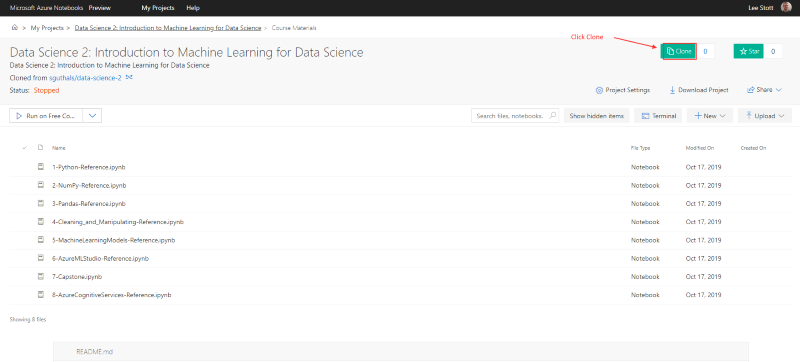

# Data Science 2: Introduction to Machine Learning for Data Science

## Engagement Expectations
This workshop is meant to be highly interactive. The instructor will lead you in two interactive teaching styles:
1. **Interactive Lecturing:** The majority of content for this workshop is in a Notebook. Though the content will be introduced via PowerPoint, the rest of the workshop will consist of walking them through the Azure Notebooks. During this time, instructors will employ an interactive lecture style, where learners will be asked to participate by asking questions and offering up ideas.
2. **Think, Pair, Share:** For some of the more complex topics, the instructor will use the "Think, Pair, Share" method. This is where you will be asked a question and given about 45 seconds to think quietly to yourself. During this time it is imperative that you are not discussing with others yet. Then, you will have an opportunity to disucss with the 1-2 people next to you. Make sure you don't just share your answer, but *why* you think that is the answer. Finally, the isntructor will ask for a few people to share what they discussed with their neighbors. 

*Notice*: Various interactive cues are called out in the Notebooks. These are suggestions and at the instructor's discression.

## Today's Schedule
| Hour | T| opic |
| ---- |-| ----- | 
| 9:30 - 10:00am | | Introduction to Data Science Keynote |
| 10:00 - 11:00pm | | Introduction and Refresher [Python](Course%20Material/1-Python-Reference.ipynb)
| 12:00 - 1:00pm | | Introduction to [NumPy](Course%20Material/2-NumPy-Reference.ipynb) & [Pandas](Course%20Material/3-Pandas-Reference.ipynb) |
| 12:00 - 12:30pm | | Lunch | 
| 12:30 - 1:30pm | | Introduction to [Data cleaning and manipulation](4-Cleaning_and_Manipulating-Reference.ipynb)| 
| 1:30 - 2:30pm | | [Introduction to Machine Learning Models and Linear Regression](Course%20Material/5-MachineLearningModels-Reference.ipynbb) |
| 2:00 - 2:10pm | | Break |
| 2:30 - 3:45pm | | [Using the Cloud for Machine Learning with Azure ML Studio](Course%20Material/6-AzureMLStudio-Reference.ipynb) | 
| 3:45 - 4pm | | Wrap Up |

## Content
The primary source of content will be relatively bare Azure Notebooks where the instructor will guide you through discovering the different features of Python, NumPy, Pandas, and general data cleaning and manipulation. 

The folder called "Course Material" has all of the content and exercises, plus written explanations and additional features and exercise not covered in this workshop. 

## Clone the Content 

Cloning creates a copy of an existing project in your own account, where you can then run and modify any notebook or other file in the project. You can also use cloning to make copies of your own projects in which you do experiments or other work without disturbing the original project.

To clone a project

Clone command on project context menu

In the Clone Project popup, enter a name and ID for the clone, and specify whether the clone is public. These settings are the same as for a new project.

After you select the Clone button, Azure Notebooks navigates directly to the copy

## Tips and Tricks
Azure Notebooks is still in Preview. This means that there are some times when it will fail. Here are some tips for avoiding losing your work:
- Ensure their work is being saved. In the Jupyter Notebook there is always one of two messages to the right of the title of the notebook: `(autosaved)` or `(unsaved changes)`. Make sure you're noticing that your work is being saved. You should consider checking every 10 minutes or so. 
- Sometimes Notebooks get into a state where the Kernel cannot be started. Sometimes re-starting the kernel will work. But often you will have to somepletely sign out of Azure Notebooks and then sign back in. 

## New to Python, Pandas, NumPy or Data Cleaning and Manipulation?

Additionally, if you need a referesher on how to code in Python or work with NumPy or Pandas, we recommend you check out the materials from our other Reactor Workshop:

#### Introduction and Refresher 

[Python](Course%20Material/1-Python-Reference.ipynb)

[NumPy](Course%20Material/2-NumPy-Reference.ipynb)

[Pandas](Course%20Material/3-Pandas-Reference.ipynb)

[Data cleaning and manipulation](4-Cleaning_and_Manipulating-Reference.ipynb)

## Additional Learning Resources 

Microsoft Learn Interactive Labs

[Intro to ML](https://docs.microsoft.com/en-us/learn/paths/intro-to-ml-with-python)

[Building an AI Solution with ML Services](https://docs.microsoft.com/en-us/learn/paths/build-ai-solutions-with-azure-ml-service/)

[Getting Started with Azure DSVM](https://docs.microsoft.com/en-us/learn/paths/get-started-with-azure-dsvm/)

[DataScience Tools in Azure](https://docs.microsoft.com/en-us/learn/paths/explore-data-science-tools-in-azure/)

[Azure Fundamentals](https://docs.microsoft.com/en-us/learn/paths/azure-fundamentals/)
